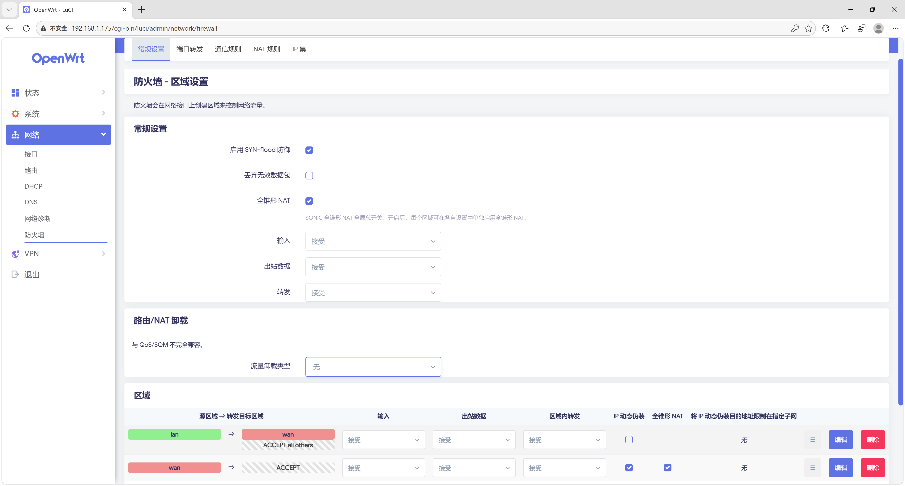
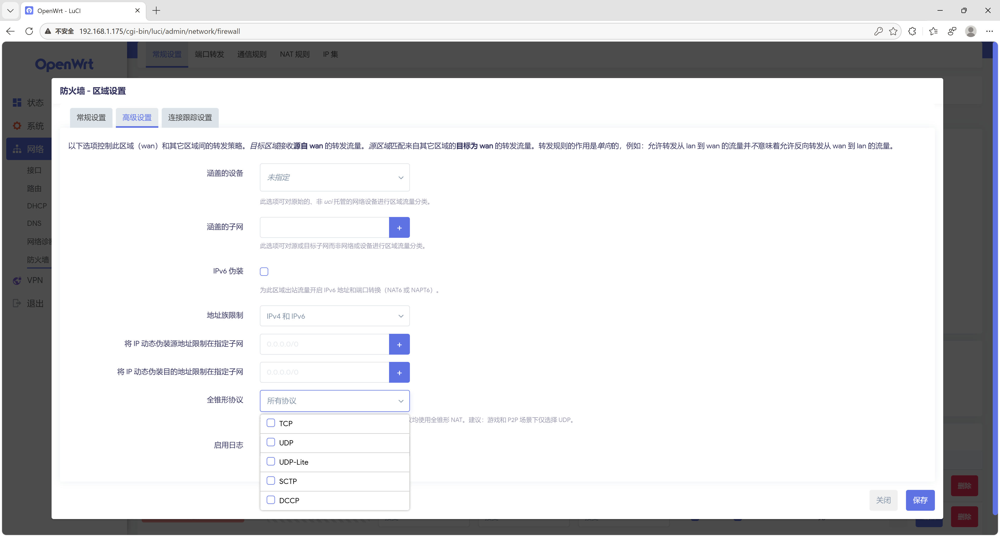

# openwrt-sonic-fullcone

[简体中文](./README.md) | English

SONiC-style Full Cone NAT for OpenWrt, with per-zone and per-protocol granularity.

## What is this

A port of the [SONiC fullcone NAT kernel patch](https://github.com/sonic-net/sonic-linux-kernel/blob/master/patches-sonic/Support-for-fullcone-nat.patch) (Akhilesh Samineni / Broadcom) to OpenWrt, bundled with the firewall and LuCI integration needed for fine-grained control.

### How it works

The kernel patch adds a second hash table inside conntrack (`nat_by_manip_src`), keyed by the **post-translation 3-tuple** (protocol, source IP, source port):

- **SNAT direction**: 3-tuple uniqueness guarantees that the same (proto, src_ip, src_port) is never reused by a different connection — this gives Endpoint-Independent Mapping (EIM).
- **DNAT direction**: reverse lookup — inbound packets find the original internal host through the hash table, providing Endpoint-Independent Filtering (EIF).
- **Full L4 protocol coverage**: TCP, UDP, ICMP, GRE, SCTP, DCCP, UDPlite.
- **Zero overhead for non-fullcone traffic**: the fullcone flag is per-rule, not global.

### Supported kernel versions

6.6, 6.12, 6.18 (all three share the same patch — the relevant `nf_nat_core.c` layout is identical across them).

## Installation

### Prerequisites

- An OpenWrt source tree (master / 25.12 / 24.10)
- Kernel 6.6 / 6.12 / 6.18
- `git` and `curl` available on the build host

> 23.05 is no longer supported: its iptables 1.8.8 has no `extensions/libxt_NAT.c` (added in 1.8.9), and two hunks of the firewall4 patch no longer apply.

### One-shot install

From the root of your OpenWrt source tree:

```bash
# Update feeds first (required for the LuCI patch)
./scripts/feeds update -a
./scripts/feeds install -a

# Apply all patches
curl -sSL https://raw.githubusercontent.com/mufeng05/openwrt-sonic-fullcone/master/add_sonic_fullcone.sh | bash

# Build
make menuconfig   # No extra options needed — fullcone is compiled into the existing nft_masq.ko / xt_MASQUERADE.ko
make -j$(nproc)
```

The script clones the repo, detects the kernel version, copies the patches into the right places, and cleans up temporary files when done.

> **Note**: besides copying patches, the script also adds `PKG_FIXUP:=autoreconf` to `package/libs/libnftnl/Makefile`.
> The libnftnl patch touches `src/Makefile.am`, which makes automake try to regenerate `Makefile.in` using the exact version that produced the tarball (`automake-1.17` for libnftnl 1.3.1). That version is usually absent from the build environment, so the build fails with `automake-1.17: command not found`.
> This edits the OpenWrt source tree itself, so a `git pull` of the tree reverts it — just **re-run this script** afterwards. If the build already failed once, also run `make package/libs/libnftnl/clean` before rebuilding.

### Uninstall

Remove the patch files and rebuild:

```bash
rm -f target/linux/generic/hack-*/984-add-sonic-fullcone-*.patch
rm -f target/linux/generic/hack-*/985-add-sonic-fullcone-*.patch
rm -f target/linux/generic/hack-*/986-add-sonic-fullcone-*.patch
rm -f package/network/utils/iptables/patches/901-sonic-fullcone.patch
rm -f package/network/config/firewall*/patches/001-sonic-fullcone.patch
rm -f feeds/luci/applications/luci-app-firewall/patches/001-add-fullcone-options.patch

make target/linux/clean
make package/network/utils/iptables/clean
make package/network/config/firewall/clean
make package/network/config/firewall4/clean
make package/feeds/luci/luci-app-firewall/clean
make -j$(nproc)
```

Note: the `libnftnl` and `nftables` patches (which add the `fullcone` keyword) can stay — they do not affect normal behavior.

## Configuration

### Configuration logic

`defaults.fullcone` is the **global master switch**:

- **Off** (default): all fullcone functionality is disabled, settings inside zones have no effect.
- **On**: the feature is available, but each zone still has to **opt in** with its own fullcone checkbox.

This mirrors how OpenWrt's `flow_offloading` works.

### Web UI (LuCI)

The LuCI patch wires the fullcone options directly into OpenWrt's native firewall configuration pages — no extra LuCI app needed.

**Global settings** (Network → Firewall → General Settings):
- "Fullcone NAT" checkbox — global master switch.



**Zone editing** (Network → Firewall → Zones → Edit):
- **General tab**: "Fullcone NAT" checkbox (only shown when masquerading is enabled), visible both in the zone list and the edit dialog.
- **Advanced tab**: "Fullcone protocols" multi-select (TCP, UDP, UDP-Lite, SCTP, DCCP) — restrict by protocol.



### UCI command line

```bash
# 1. Turn on the global master switch (required)
uci set firewall.@defaults[0].fullcone='1'

# 2. Enable fullcone on the wan zone
uci set firewall.@zone[1].fullcone='1'

# 3. Optional: limit to UDP only (recommended for gaming / P2P)
uci add_list firewall.@zone[1].fullcone_proto='udp'

# Apply
uci commit firewall
/etc/init.d/firewall restart

# Verify
nft list ruleset | grep fullcone
```

### UCI config example

**Basic**: fullcone on all zones, all protocols

```
config defaults
    option fullcone '1'           # global master switch

config zone
    option name 'wan'
    option masq '1'
    option fullcone '1'           # enable fullcone for this zone
```

**UDP only**:

```
config zone
    option name 'wan'
    option masq '1'
    option fullcone '1'
    list fullcone_proto 'udp'     # only UDP gets fullcone, the rest goes through standard masquerade
```

Generated nftables rules:

```nft
chain srcnat_wan {
    meta nfproto ipv4 meta l4proto udp fullcone  # UDP → fullcone
    meta nfproto ipv4 masquerade                 # other → standard masquerade
}
chain dstnat_wan {
    meta nfproto ipv4 meta l4proto udp fullcone  # UDP-only reverse mapping
}
```

### Advanced: hand-written nftables rules

For more complex match conditions, drop a file into `/etc/nftables.d/`:

```nft
# /etc/nftables.d/10-fullcone-custom.nft
table inet fullcone-custom {
    chain srcnat {
        type nat hook postrouting priority srcnat + 1; policy accept;
        oifname "eth1" ip saddr 192.168.1.0/24 meta l4proto udp fullcone
    }
    chain dstnat {
        type nat hook prerouting priority dstnat + 1; policy accept;
        iifname "eth1" meta l4proto udp fullcone
    }
}
```

When using custom rules, disable the fw4 fullcone option for that zone to avoid conflicts.

## Verification

After flashing the firmware:

```bash
# 1. Confirm the nftables fullcone expression is available (fw4)
echo 'add table ip test; add chain ip test t { fullcone; }' | nft -c -f -
# No error → kernel support is in place

# 2. Check that rules were generated (depends on UCI configuration)
nft list ruleset | grep fullcone                            # fw4
iptables -t nat -S | grep FULLCONE                          # fw3

# 3. Test NAT type from a LAN host
pystun3   # or NatTypeTester on Windows
# Expected result: "Full Cone"
```

## Known limitations

### fw3 (iptables)

- **fw3 only generates IPv4 NAT rules**: in firewall3's `zones.c`, `print_zone_rule` checks `if (zone->masq && handle->family == FW3_FAMILY_V4)` inside the `FW3_TABLE_NAT` branch, and IPv6 takes a different path. As a result, this project's fw3 patch only emits IPv4 fullcone rules.

  **Adding IPv6 fullcone manually**: kernel-side patches 984/985 and the userspace 901 patch are protocol-family agnostic — the `FULLCONE` target is registered for both IPv4 and IPv6. Add the rules in `/etc/firewall.user`:

  ```bash
  ip6tables -t nat -A POSTROUTING -o wan -j FULLCONE
  ip6tables -t nat -A PREROUTING  -i wan -j FULLCONE
  ```

### General

- **Port parity preservation (RFC 4787 REQ-3b) is not implemented**: fullcone port allocation does not guarantee odd-to-odd / even-to-even mapping. Modern applications (gaming, WebRTC, VoIP) almost never depend on this.

- **Hairpinning (NAT loopback) is out of scope**: a LAN host reaching another LAN host through the WAN address requires a separate NAT reflection rule.

## Comparison with other fullcone implementations

| | SONiC (this project) | xt_FULLCONENAT | nft-fullcone | bcm-fullconenat |
|---|---|---|---|---|
| Mapping storage | Inside conntrack itself | Parallel hash table | Parallel hash table | conntrack expectation table |
| Read-path locking | RCU (no spinlock) | Global spinlock | Global spinlock | Global expect lock |
| Lookup complexity | O(1) hash | O(1) hash | O(1) hash | **O(N) full scan** |
| Protocol coverage | All L4 | UDP only | UDP only | UDP only |
| Cleanup | Automatic (conntrack lifecycle) | Workqueue GC | Workqueue GC | Expectation timeout |
| Per-rule control | Yes (flag bit) | No | No | No |
| EIM + EIF | Dual hooks (PRE+POST) automatically | Dual hooks automatically | Dual hooks automatically | Relies on the helper mechanism |
| Extra kernel module | None (embedded in nf_nat / nft_masq / xt_MASQUERADE) | Standalone .ko | Standalone .ko | None (in-tree patch) |

## Relationship with turboacc

This project and [turboacc](https://github.com/coolsnowwolf/luci/tree/openwrt-23.05/applications/luci-app-turboacc) are not the same kind of thing and cannot be directly compared.

### Different scope

| | openwrt-sonic-fullcone | turboacc |
|---|---|---|
| What it is | Does one thing: full cone NAT | A bundle of acceleration engines (Flow Offloading + SFE + fullcone + BBR) |
| Fullcone implementation | SONiC kernel patch (Broadcom, production-grade) | Chion / llccd's xt_FULLCONENAT + bcm-fullconenat + nft-fullcone (community implementations) |

### Side-by-side on fullcone

For detailed technical comparison see the [fullcone implementations table](#comparison-with-other-fullcone-implementations) above; here is the diff against turboacc specifically:

| | sonic-fullcone (this project) | turboacc's fullcone |
|---|---|---|
| Granularity | per-zone, per-proto | global toggle |
| fw3 support | Embedded in xt_MASQUERADE.ko | Standalone xt_FULLCONENAT.ko, or embedded in nf_nat_masquerade (bcm) |
| fw4 support | Embedded in nft_masq.ko | Standalone nft_fullcone.ko |
| LuCI | Integrated into the native firewall pages | Separate luci-app-turboacc page |
| Code provenance | Official SONiC kernel patch | Patchwork from several community projects |

### Where each one wins

**sonic-fullcone is better at**:
- Cleaner kernel implementation (RCU, no separate module, every protocol)
- Clear code provenance (official SONiC, written by Broadcom engineers)
- Focused feature set, easier to maintain

**turboacc is better at**:
- It's not just fullcone — also Flow Offloading, SFE, BBR, and other acceleration features
- Mature community ecosystem, large user base, well battle-tested
- Chion's xt_FULLCONENAT only supports UDP, but UDP covers ~99% of fullcone use cases and has years of production usage behind it

### Bottom line

- **Fullcone only** → sonic-fullcone (better architecture, more complete coverage)
- **Full acceleration bundle** → turboacc (fullcone is just one of its sub-features)
- **Can the two coexist?** → Not recommended; the fullcone kernel patches conflict.

For most home router users, turboacc's Chion fullcone (UDP only) is enough — gaming, P2P, and VoIP are all UDP. The full-protocol coverage and RCU read path of sonic-fullcone matter more under high concurrency, which home users rarely notice.

That said, in today's **fw4 (nftables)** environment, the rest of turboacc is no longer irreplaceable:

- **Flow Offloading**: shipped with OpenWrt — just enable `kmod-nft-offload` in `menuconfig`.
- **BBR**: in the kernel — pick `TCP_CONG_BBR` in `menuconfig`, or set it via a one-line `sysctl`.
- **SFE**: depends on the iptables conntrack chain events interface, incompatible with fw4 / nftables, only usable on fw3.

So for fw4 users, turboacc's unique value is essentially fullcone. Its real value lives on **older fw3 firmware**: SFE + fullcone + a unified LuCI panel is genuinely convenient there. But since OpenWrt 23.05+ defaults to fw4, that value keeps shrinking.

## File layout

```
kernel/
  984-add-sonic-fullcone-support.patch      # nf_nat_core.c: 3-tuple hash table, EIM/EIF
  985-add-sonic-fullcone-to-ipt.patch       # xt_MASQUERADE.c: iptables FULLCONE target (PRE+POST)
  986-add-sonic-fullcone-to-nft.patch       # nft_masq.c: nftables fullcone expression (PRE+POST)

patches/
  iptables/901-sonic-fullcone.patch         # libxt_NAT.c: register the FULLCONE userspace target
  libnftnl/001-libnftnl-*.patch             # fullcone expression serialization
  nftables/002-nftables-*.patch             # nft CLI "fullcone" keyword
  luci-app-firewall/001-add-*.patch         # LuCI Web UI integration

translations/
  zh_Hans.po                                # Simplified Chinese translation (appended to po files at install time)

firewall/
  firewall3/001-sonic-fullcone.patch        # fw3: per-zone, per-proto, EIM+EIF
  firewall4/001-sonic-fullcone.patch        # fw4: per-zone, per-proto, EIM+EIF
```

## Acknowledgements

- Kernel patch: Akhilesh Samineni (Broadcom), from [sonic-net/sonic-linux-kernel](https://github.com/sonic-net/sonic-linux-kernel)
- nftables / libnftnl expression interface: Syrone Wong (fullcone-nat-nftables)
- OpenWrt integration: openwrt-sonic-fullcone contributors

## License

Kernel patches: GPL-2.0 (in line with the Linux kernel license)
Userspace patches: GPL-2.0
