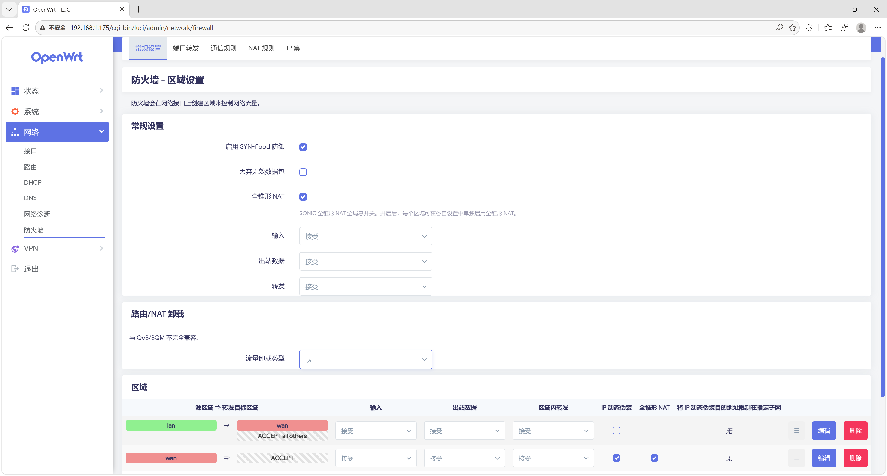
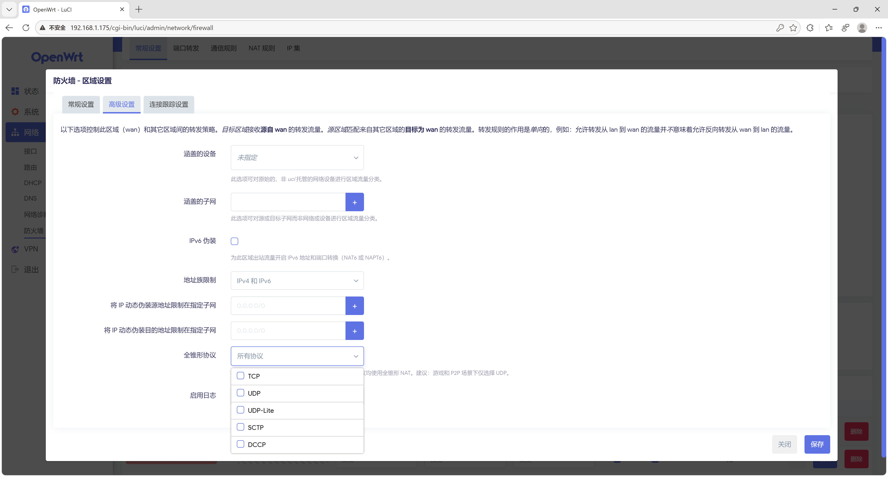

# openwrt-sonic-fullcone

适用于 OpenWrt 的 SONiC 风格全锥形 NAT（Full Cone NAT），支持 per-zone、per-protocol 粒度控制。

## 这是什么

将 [SONiC 的 fullcone NAT 内核补丁](https://github.com/sonic-net/sonic-linux-kernel/blob/master/patches-sonic/Support-for-fullcone-nat.patch)（Akhilesh Samineni / Broadcom）移植到 OpenWrt，并集成了支持细粒度控制的防火墙和 LuCI 界面。

### 工作原理

内核补丁在 conntrack 内部增加了第二张哈希表（`nat_by_manip_src`），以**转换后的 3-tuple**（协议、源 IP、源端口）为索引：

- **SNAT 方向**：3-tuple 唯一性保证——同一个 (proto, src_ip, src_port) 不会被不同连接复用，实现端点无关映射（EIM）
- **DNAT 方向**：反向查找——入站数据包通过哈希表找到原始内部主机，实现端点无关过滤（EIF）
- **全 L4 协议支持**：TCP、UDP、ICMP、GRE、SCTP、DCCP、UDPlite
- **非 fullcone 流量零开销**：fullcone 标志位是 per-rule 的，不是全局的

### 支持的内核版本

6.6、6.12、6.18（三个版本共用同一份补丁——相关的 nf_nat_core.c 结构完全一致）

## 安装

### 先决条件

- OpenWrt 源码树（master 或 23.05+，其他版本未测试）
- 内核 6.6 / 6.12 / 6.18
- 主机已安装 `git`、`curl`

### 一键安装

在 OpenWrt 源码目录下执行：

```bash
# 先更新 feeds（LuCI 补丁需要）
./scripts/feeds update -a
./scripts/feeds install -a

# 一键应用所有补丁
curl -sSL https://raw.githubusercontent.com/mufeng05/openwrt-sonic-fullcone/master/add_sonic_fullcone.sh | bash

# 编译
make menuconfig   # 无需额外勾选，fullcone 编译进现有 nft_masq.ko / xt_MASQUERADE.ko 模块
make -j$(nproc)
```

脚本会自动 clone 仓库、检测内核版本、复制补丁到对应位置，完成后自动清理临时文件。

### 卸载

删除补丁文件后重新编译即可：

```bash
rm -f target/linux/generic/hack-*/984-add-sonic-fullcone-*.patch
rm -f target/linux/generic/hack-*/985-add-sonic-fullcone-*.patch
rm -f target/linux/generic/hack-*/986-add-sonic-fullcone-*.patch
rm -f package/network/utils/iptables/patches/901-sonic-fullcone.patch
rm -f package/network/config/firewall*/patches/001-sonic-fullcone.patch
rm -f feeds/luci/applications/luci-app-firewall/patches/001-add-fullcone-options.patch

make target/linux/clean
make package/network/utils/iptables/clean
make package/network/config/firewall/clean
make package/network/config/firewall4/clean
make package/feeds/luci/luci-app-firewall/clean
make -j$(nproc)
```

注意：libnftnl 和 nftables 补丁（添加 `fullcone` 关键字）保留即可——它们不会影响普通行为。

## 配置

### 配置逻辑

`defaults.fullcone` 是**全局总开关**：

- **关闭时**（默认）：所有 fullcone 功能禁用，zone 里的设置无效
- **开启时**：功能可用，但每个 zone 还需要**单独勾选** fullcone 才会生效

这和 OpenWrt 的 `flow_offloading` 是同样的模式。

### Web 界面（LuCI）

LuCI 补丁将 fullcone 选项直接集成到 OpenWrt 原生防火墙配置页面中，无需安装额外的 LuCI 应用。

**全局设置**（网络 → 防火墙 → 常规设置）：
- "Fullcone NAT" 复选框 — 全局总开关



**Zone 编辑**（网络 → 防火墙 → 区域 → 点击编辑）：
- **常规标签**："Fullcone NAT" 复选框（仅在开启伪装时出现），在 zone 列表和编辑弹窗中均可见
- **高级标签**："Fullcone protocols" 多选框（TCP、UDP、UDP-Lite、SCTP、DCCP）— 限定协议



### UCI 命令行

```bash
# 1. 打开全局总开关（必须）
uci set firewall.@defaults[0].fullcone='1'

# 2. 对 wan zone 启用 fullcone
uci set firewall.@zone[1].fullcone='1'

# 3. 可选：仅对 UDP 启用（推荐用于游戏/P2P）
uci add_list firewall.@zone[1].fullcone_proto='udp'

# 应用
uci commit firewall
/etc/init.d/firewall restart

# 验证
nft list ruleset | grep fullcone
```

### UCI 配置文件示例

**基本用法**：全 zone 全协议 fullcone

```
config defaults
    option fullcone '1'           # 全局总开关

config zone
    option name 'wan'
    option masq '1'
    option fullcone '1'           # 此 zone 启用 fullcone
```

**仅 UDP**：

```
config zone
    option name 'wan'
    option masq '1'
    option fullcone '1'
    list fullcone_proto 'udp'     # 仅 UDP 走 fullcone，其余走标准 masquerade
```

生成的 nftables 规则：

```nft
chain srcnat_wan {
    meta nfproto ipv4 meta l4proto udp fullcone  # UDP → fullcone
    meta nfproto ipv4 masquerade                 # 其余 → 标准 masquerade
}
chain dstnat_wan {
    meta nfproto ipv4 meta l4proto udp fullcone  # 仅 UDP 反向映射
}
```

### 高级：手写 nftables 规则

如需更复杂的匹配条件，可使用 `/etc/nftables.d/`：

```nft
# /etc/nftables.d/10-fullcone-custom.nft
table inet fullcone-custom {
    chain srcnat {
        type nat hook postrouting priority srcnat + 1; policy accept;
        oifname "eth1" ip saddr 192.168.1.0/24 meta l4proto udp fullcone
    }
    chain dstnat {
        type nat hook prerouting priority dstnat + 1; policy accept;
        iifname "eth1" meta l4proto udp fullcone
    }
}
```

注意：使用自定义规则时，应关闭该 zone 的 fw4 fullcone 选项以避免冲突。

## 验证

刷机后检查：

```bash
# 1. 确认 nftables fullcone 表达式可用（fw4）
echo 'add table ip test; add chain ip test t { fullcone; }' | nft -c -f -
# 没报错说明内核支持

# 2. 检查规则是否生成（取决于 UCI 配置）
nft list ruleset | grep fullcone                            # fw4
iptables -t nat -S | grep FULLCONE                          # fw3

# 3. 测试 NAT 类型（局域网电脑上）
pystun3   # 或 Windows 上用 NatTypeTester
# 结果应为 "Full Cone"
```

## 已知限制

### fw3 (iptables) 相关

- **fw3 代码只对 IPv4 生成 NAT 规则**：firewall3 的 `zones.c` 里 `print_zone_rule` 在 `FW3_TABLE_NAT` 分支中有 `if (zone->masq && handle->family == FW3_FAMILY_V4)` 判断，IPv6 走不同路径。因此本项目的 fw3 patch 只生成 IPv4 fullcone 规则。

  **手动添加 IPv6 fullcone**：内核侧的 984/985 补丁和 901 用户态补丁都是 IPv4/IPv6 通用的，`FULLCONE` target 对两个协议族都注册了。可以在 `/etc/firewall.user` 里手动加：

  ```bash
  ip6tables -t nat -A POSTROUTING -o wan -j FULLCONE
  ip6tables -t nat -A PREROUTING  -i wan -j FULLCONE
  ```

### 通用限制

- **端口奇偶保持（RFC 4787 REQ-3b）未实现**：fullcone 端口分配不保证奇数端口映射到奇数、偶数映射到偶数。现代应用（游戏、WebRTC、VoIP）几乎不依赖此特性。

- **Hairpinning（NAT 回流）不由本项目处理**：内网主机通过外网地址访问另一个内网主机的场景，需要另行配置 NAT reflection 规则。

## 与其他 fullcone 实现的对比

| | SONiC（本项目） | xt_FULLCONENAT | nft-fullcone | bcm-fullconenat |
|---|---|---|---|---|
| 映射存储 | conntrack 自身内 | 平行哈希表 | 平行哈希表 | conntrack 期望表 |
| 读路径锁 | RCU（无自旋锁） | 全局自旋锁 | 全局自旋锁 | 全局 expect 锁 |
| 查找复杂度 | O(1) 哈希 | O(1) 哈希 | O(1) 哈希 | **O(N) 全表扫描** |
| 协议支持 | 全部 L4 | 仅 UDP | 仅 UDP | 仅 UDP |
| 清理机制 | 自动（conntrack 生命周期） | Workqueue GC | Workqueue GC | 期望超时 |
| Per-rule 控制 | 支持（flag bit） | 不支持 | 不支持 | 不支持 |
| EIM + EIF | 双钩子（PRE+POST）自动 | 双钩子自动 | 双钩子自动 | 依赖 helper 机制 |
| 额外内核模块 | 无（嵌入 nf_nat/nft_masq/xt_MASQUERADE） | 独立 .ko | 独立 .ko | 无（in-tree patch） |

## 与 turboacc 的关系

本项目与 [turboacc](https://github.com/coolsnowwolf/luci/tree/openwrt-23.05/applications/luci-app-turboacc) 不是同一类东西，不能直接比较。

### 定位不同

| | openwrt-sonic-fullcone | turboacc |
|---|---|---|
| 是什么 | 只做一件事：全锥形 NAT | 加速引擎合集（Flow Offloading + SFE + fullcone + BBR） |
| fullcone 实现 | SONiC 内核补丁（Broadcom 出品，生产级） | Chion/llccd 的 xt_FULLCONENAT + bcm-fullconenat + nft-fullcone（社区实现） |

### fullcone 单项对比

详细技术指标参见上方[与其他 fullcone 实现的对比](#与其他-fullcone-实现的对比)表格，以下为与 turboacc 的补充对比：

| | sonic-fullcone（本项目） | turboacc 的 fullcone |
|---|---|---|
| 粒度控制 | per-zone、per-proto | 全局开关 |
| fw3 支持 | 嵌入 xt_MASQUERADE.ko | 独立 xt_FULLCONENAT.ko 或嵌入 nf_nat_masquerade（bcm） |
| fw4 支持 | 嵌入 nft_masq.ko | 独立 nft_fullcone.ko |
| LuCI | 集成到原生防火墙页面 | 独立 luci-app-turboacc 页面 |
| 代码来源 | SONiC 官方内核补丁 | 社区多个项目拼接 |

### 各自的优势

**sonic-fullcone 更好的地方**：
- 内核实现更优雅（RCU、无独立模块、全协议）
- 代码血统清晰（SONiC 官方，Broadcom 工程师编写）
- 功能纯粹，维护简单

**turboacc 更好的地方**：
- 不只是 fullcone——还有 Flow Offloading、SFE、BBR 等加速功能
- 社区生态成熟，用户基数大，实战验证充分
- Chion 的 xt_FULLCONENAT 虽然只支持 UDP，但 UDP 覆盖了 99% 的 fullcone 需求场景，且经过多年生产验证

### 结论

- **只要 fullcone** → sonic-fullcone 更好（架构更优，功能更完整）
- **要加速全家桶** → turboacc（fullcone 只是它的一个子功能）
- **两个可以共存吗** → 不建议，fullcone 内核补丁会冲突

对大多数家用路由器用户来说，turboacc 的 Chion fullcone（UDP only）已经够用——游戏、P2P、VoIP 全是 UDP。sonic-fullcone 的全协议支持和 RCU 读路径在高并发场景更有价值，家用感知不明显。

不过在当前 **fw4 (nftables)** 环境下，turboacc 的其他组件并非不可替代：

- **Flow Offloading**：OpenWrt 原生自带，`menuconfig` 勾选 `kmod-nft-offload` 即可
- **BBR**：内核自带，`menuconfig` 选择 `TCP_CONG_BBR` 即可，或 sysctl 一行命令
- **SFE**：依赖 iptables conntrack chain events 接口，与 fw4/nftables 不兼容，仅 fw3 可用

所以对 fw4 用户来说，turboacc 的独有价值主要就是 fullcone。turboacc 的真正价值在 **fw3 老固件**上：SFE + fullcone + 统一 LuCI 面板，这套组合在 fw3 环境下确实方便。但 OpenWrt 23.05+ 默认 fw4 后，这个价值在收窄。

## 文件说明

```
kernel/
  984-add-sonic-fullcone-support.patch      # nf_nat_core.c：3-tuple 哈希表、EIM/EIF
  985-add-sonic-fullcone-to-ipt.patch       # xt_MASQUERADE.c：iptables FULLCONE target (PRE+POST)
  986-add-sonic-fullcone-to-nft.patch       # nft_masq.c：nftables fullcone 表达式 (PRE+POST)

patches/
  iptables/901-sonic-fullcone.patch         # libxt_NAT.c：注册 FULLCONE 用户态 target
  libnftnl/001-libnftnl-*.patch             # fullcone 表达式序列化
  nftables/002-nftables-*.patch             # nft CLI "fullcone" 关键字
  luci-app-firewall/001-add-*.patch         # LuCI Web 界面集成

translations/
  zh_Hans.po                                # 中文翻译（安装时追加到 po 文件）

firewall/
  firewall3/001-sonic-fullcone.patch        # fw3：per-zone, per-proto, EIM+EIF
  firewall4/001-sonic-fullcone.patch        # fw4：per-zone, per-proto, EIM+EIF
```

## 致谢

- 内核补丁：Akhilesh Samineni (Broadcom)，来自 [sonic-net/sonic-linux-kernel](https://github.com/sonic-net/sonic-linux-kernel)
- nftables/libnftnl 表达式接口：Syrone Wong (fullcone-nat-nftables)
- OpenWrt 集成：openwrt-sonic-fullcone contributors

## 许可证

内核补丁：GPL-2.0（遵循 Linux 内核许可证）
用户态补丁：GPL-2.0
